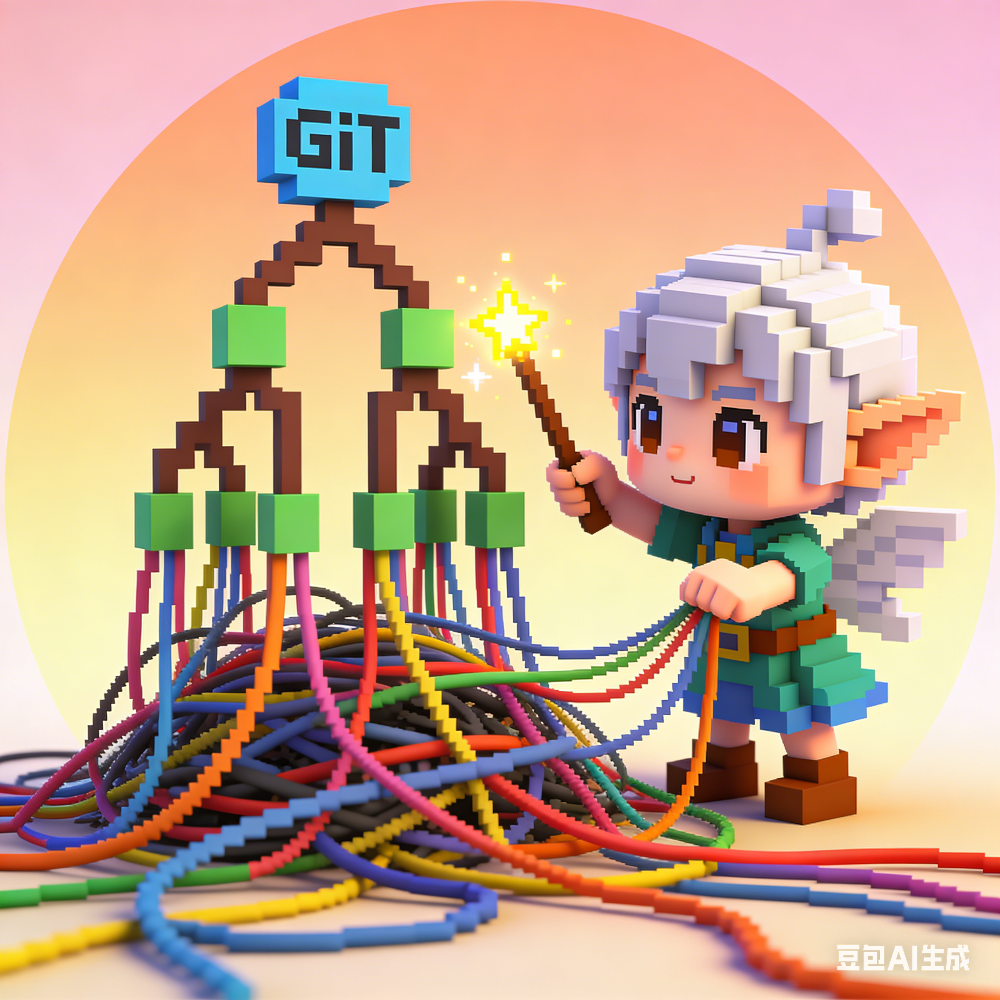

# software-engineering
# 团队 Logo 设计：熵减精灵

## 💡 设计理念

软件工程的核心是**控制复杂性**——在物理世界中，这叫“熵减”。我们将这一抽象概念具象化为一只可爱的 **“熵减精灵”**：

- 精灵用魔法棒将**杂乱的电线、破碎的代码符号**（代表混沌的代码、未管理的依赖、混乱的逻辑）  
- 整理成**有序的 Git 分支树与 Github 贡献图雕塑**（代表版本控制、清晰架构、规范协作）

用 Q 版画风 + 明亮色彩，打破技术领域常见的“冷硬”视觉定式，用“可爱的反差感”让人眼前一亮，同时暗喻：**优秀的软件工程，就是用巧思与工具将混沌变为秩序。**

---

## 🛠️ AIGC 生成过程

我们使用 Midjourney / DALL·E 等 AIGC 工具，经历了“提示词构建 → 迭代优化 → 平台适配”的完整流程。

### 1. Logo 提示词
 我们先用deepseek，使用以下提示词“我们辅修计算机，这一门课程叫“软件工程”，需要使用AIGC图像生成工具为团队的Github和博客园账号创建一个独特的团队Logo，帮我设计一个团队logo和海报，要求有创新，有新意，能让人眼前一亮”，让ai设计；ai给出了三个方案
 方案一：极简·代码魔方 (适合 Github 头像，耐看)
 方案二：新中式·鲁班锁与二进制 (适合博客园，显文化底蕴)
 方案三：超现实·熵减精灵 (视觉冲击力最强)
 最后，我们选择了方案三

### 2. 图像生成
图像生成我们使用了豆包ai，ai提示词：“一个可爱的Q版小精灵角色，正努力用魔法棒把一堆杂乱无章的彩色电线整理成有序的Git分支树，像素风结合3D渲染，圆形头像构图，表情专注但可爱，背景柔和的渐变，明亮活泼，具有故事感。”

### 3. 图像问题优化
| 问题 | 优化方法 |
|------|----------|
| 精灵过于“怪物化”，不够可爱 | 增加 `cute, expressive eyes, cheerful expression`，降低 `--stylize` |
| Git 分支树不明显 | 改为 `Git branch tree with merging lines, clearly showing node and branch` |
| Logo 缩小后细节丢失 | 增加 `clean background, simple composition, vector-friendly` |

---

## 🎨 最终成果

- **Logo**：一只专注又俏皮的精灵，将乱麻般的电线编织成 Git 分支树，色彩明亮，风格独特。  

 
